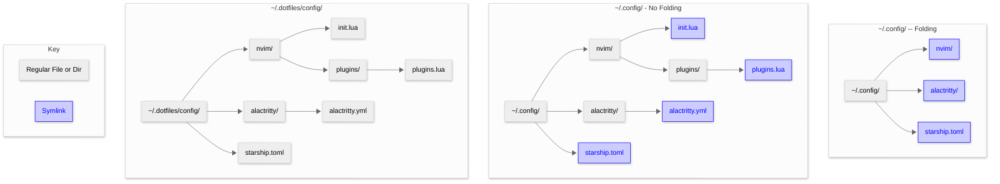

<h1>
  lnkit
  
</h1>

`lnkit` is a modern, cross-platform tool box for managing symlinks, built in Go. It simplifies the creation, maintenance, and organization of symbolic links, making it easier to manage complex file systems. Designed for speed and reliability, `lnkit` works seamlessly across different operating systems to streamline your workflow.

## Usage

| **Command**                                                                                                         | **Description**                                                                                                                                                                               | **Implemented?** |
| ------------------------------------------------------------------------------------------------------------------- | --------------------------------------------------------------------------------------------------------------------------------------------------------------------------------------------- | ---------------- |
| `lnk link [-vnfr] source [target]`                                                                                  | Creates symlink at target pointing back to the source                                                                                                                                         | ✅*              |
| `lnk unlink [-vnfr] [target=.]`                                                                                     | Removes target symlink                                                                                                                                                                        | ✅               |
| `lnk relativize [-vnfr] [target=.]`                                                                                 | Convert absolute symlink to relative                                                                                                                                                          | ❌               |
| `lnk list [-vnr] [target=.]`                                                                                        | Lists all symlinks inside the target directory                                                                                                                                                | ❌               |
| `lnk clean [-vnfr] [target=.]`                                                                                      | Remove broken symlinks inside target                                                                                                                                                          | ❌               |
| `lnk scan [-vn] [target=.] [--max-depth=n]`                                                                         | Lists all symlinks in target including the depth of each symlink.                                                                                                                             | ❌               |
| `lnk track [-vnfr] symlink [--pattern=pattern \| --sort=version\|time\|name \| --script=path] [--item=first\|last]` | Creates or updates a tracking symlink based on matching targets filtered by pattern, sorted by criteria, or dynamically resolved by a user script. Selects first or last match.               | ❌*              |
| `lnk autolink [-vnfr] [--pattern=pattern] [--target=dir=~] [--folders ...]`                                         | Automatically scans the specified directory (e.g., a shared volume) for matching folders and creates symlinks in the target directory, maintaining or fixing links for selected folder names. | ❌*              |

| **Option**          | **Description**                                               | **Implemented?** |
| ------------------- | ------------------------------------------------------------- | ---------------- |
| `-f`, `--force`     | Force all operations, e.g., overwrite existing links or files. | ❌               |
| `-r`, `--recursive` | Recursively operate on directories and subdirectories.        | ❌               |
| `-n`, `--dry-run`   | Show what would be done without making any changes.           | ❌               |
| `-v`, `--verbose`   | Print detailed information about operations performed.        | ❌               |
| `--max-depth=N`     | Limit recursion depth to N levels.                            | ❌               |
| `--relative`        | Create symlinks with relative paths instead of absolute.      | ❌               |

### `link --recursive`

The `--recursive` option is especially useful when managing dotfiles or configuration directories. Instead of linking an entire directory as a single symlink (e.g., ~/.config/nvim → ~/dotfiles/nvim), recursive linking creates symlinks for each individual file and folder inside the source directory directly into the target (e.g., linking all files inside ~/dotfiles/nvim/ into ~/.config/). This approach mirrors how tools like [GNU Stow](https://www.gnu.org/software/stow/) handle dotfiles, allowing you to manage and update configuration files granularly without nesting entire directories, making your dotfiles setup more modular, transparent, and easier to maintain.

Throw some config settings into `.lnkit.toml`:

```toml
[options]
confirm = false     # Disable confirmation prompt in the CLI (set to true for confirmation before actions).
force = false       # If set to true, existing files in the target directory will be overwritten without prompt.
create_dirs = true  # If set to true, automatically create any missing directories in the target path.
source_dir = "."    # Path to the source directory containing the files to be linked.
target_dir = "~"    # Path to the target directory where symlinks will be created.
log_level = "info"  # Log verbosity level. Options: "debug", "info", "warn", "error", "dpanic", "panic", "fatal"
```

#### Why not use a bare Git repo for dotfiles?

- I have gotten into the (perhaps reckless) habit of running `add .` and `git push` all the time—this makes managing a bare repo in `~` a bit annoying (or dangerous!)
- Bare repos clutter `~` with Git metadata or force all dotfiles into home
- To add a root level `README.md` to your dotfiles, you have to have a `README.md` always present in your home directory
- Keeping templates and generated files separate keeps your home clean and organized

#### Why not a more complicated dotfiles solution?

- Tools should do one thing, and do that thing well. Akin to the first tenet in the [Unix philosphy](https://en.wikipedia.org/wiki/Unix_philosophy)
- Want templating? Use Jinja2 (or a similar tool) as a separate step before linking your dotfiles,
- The best setups empower _learning_ and creativity—they don’t force you into rigid workflows or obscure magic

### Folding

Folding refers to the process of replacing an entire directory with a single symlink, rather than linking its contents one by one.

This behavior is useful when recursively linking configuration directories, but must be applied carefully to avoid overwriting meaningful data.

The folding logic works as follows:

- If recursion is disabled: folding doesn't apply — only the top-level directory or file is processed.
- If recursion is enabled: consult the `--fold` flag to decide whether to replace the whole directory with a symlink.

#### Example

Assume you want to link the contents of  `~/.config/nvim` to `~/.dotfiles/.config/nvim`.


### `track`

`lnk track` enables creating and maintaining dynamic symlinks that automatically update to point to the most relevant target based on a specified pattern and sorting criteria. For example, in an Obsidian vault, you might have a symlink `/journals/today` that always points to the daily note for the current date, making it easy to quickly access or open today’s journal entry. Similarly, for software development, a symlink like `/path/SDK/current` can be tracked to always point to the latest installed SDK version folder (e.g., SDK-1.9, SDK-1.10, SDK-2.0), saving you the hassle of manually updating the link whenever a new SDK version is installed. This feature supports flexible pattern matching, sorting (by version, time, or name), and even custom scripts to resolve targets, making it a powerful tool for managing "moving" symlinks that reflect evolving environments.

```toml
[track."~/vault/dailies/today"] # The name of the track is the target symlink
pattern = "~/vault/dailies/daily-*.md"

[track."~/vault/dailies/recent"] # The name of the track is the target symlink
sort = "time"             # Sort by file modified time
item = "last"             # Pick the most recent one

[track."/opt/SDK/current"]
source_dir = "/opt/SDK"   # this can be provided
pattern = "SDK-*"
```

### `autolink`

The autolink command automates creating and maintaining symlinks for commonly shared large folders—such as Downloads, Videos, or Documents—that reside on separate storage volumes shared across multiple Linux distributions. Instead of manually creating or updating these links for each environment, lnk autolink scans a specified source directory for folders matching a user-defined pattern or name list and ensures corresponding symlinks exist in the target directory (like the home folder). This approach is especially valuable for users running multi-distro setups (e.g., with NixOS and others) who want to avoid the overhead and complexity of rebuilding system configurations just to update symlinks. By decoupling symlink management from system tooling, lnk autolink offers a fast, distro-agnostic, and convenient solution to keep user environments consistent and up to date.

```toml
[autolink]
enabled = true
source_dir = "."
target_dir = "~"
folders = ["Downloads", "Videos", "Documents"]
pattern = ""              # Optional: Use glob pattern instead of explicit list
recursive = false         # Optionally link contents instead of folders
```

## Disambiguation 

- GNU Stow links targe dir to source dir. Ln links tagret file to source file

## TODO

- [ ] Improve my drawing abilities to improve the [logo](./media/mascot.png)
- [ ] Better CLI interface (e.g. y/N/p for previewing a different file)
- [ ] Add other general [symlink utilities](https://github.com/brandt/symlinks)
- [ ] Flush out general config settings... root one and those in source directories?
